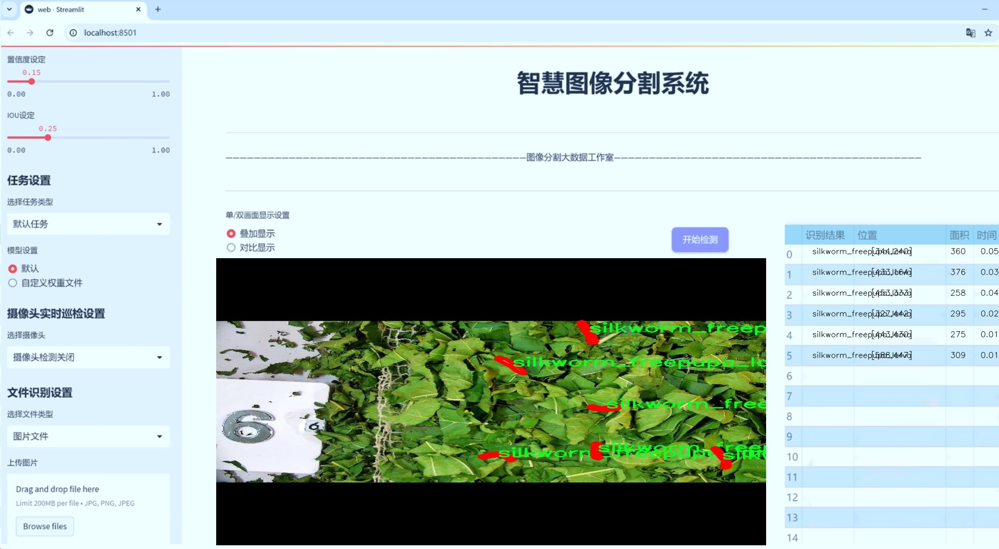
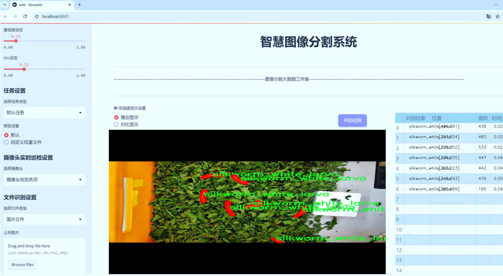
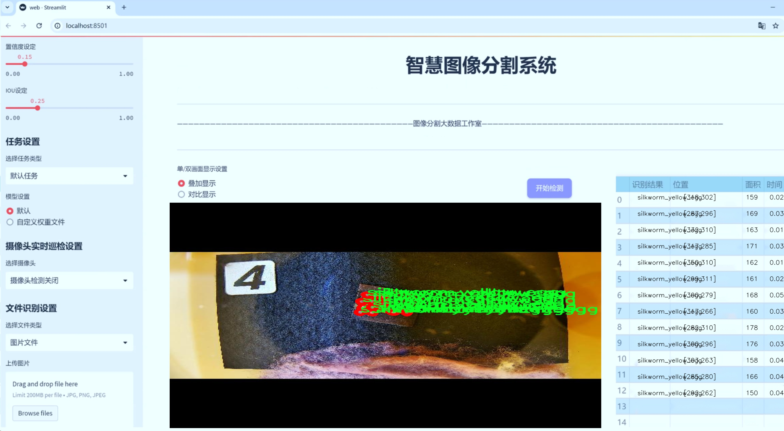
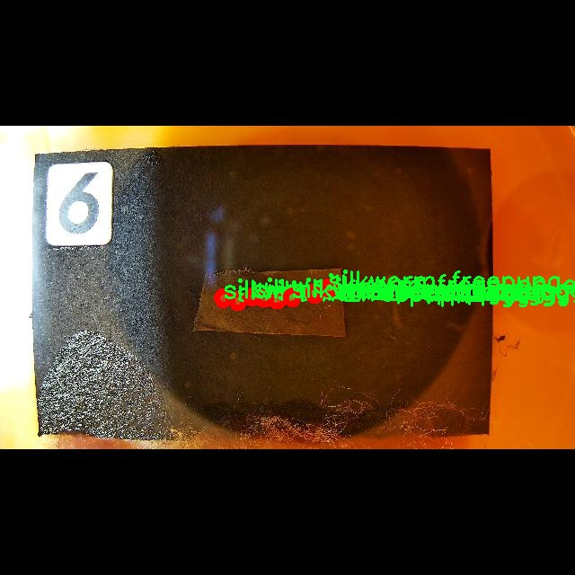
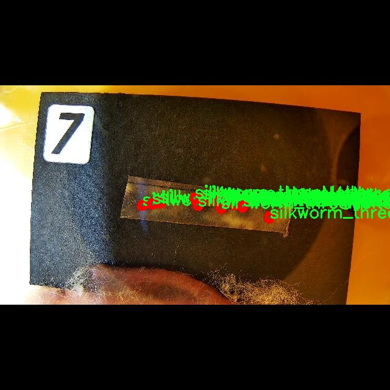
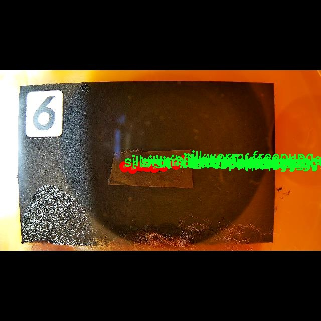

# 蚕类生长阶段分割系统： yolov8-seg-C2f-Parc

### 1.研究背景与意义

[参考博客](https://gitee.com/YOLOv8_YOLOv11_Segmentation_Studio/projects)

[博客来源](https://kdocs.cn/l/cszuIiCKVNis)

研究背景与意义

随着全球对蚕丝产业的需求不断增加，蚕类的高效养殖和管理显得尤为重要。蚕类的生长阶段包括卵、幼虫、蛹等多个阶段，每个阶段的生长特征和生物学特性均有所不同。因此，准确识别和分割蚕类的不同生长阶段，不仅有助于提高养殖效率，还能有效防控疾病，提升蚕丝的产量和质量。传统的人工识别方法往往耗时耗力，且受主观因素影响较大，难以实现高效、准确的分类。因此，基于计算机视觉技术的自动化识别与分割系统应运而生，成为解决这一问题的重要手段。

在众多计算机视觉算法中，YOLO（You Only Look Once）系列因其高效的实时目标检测能力而受到广泛关注。YOLOv8作为该系列的最新版本，具备更强的特征提取能力和更快的处理速度，适合应用于动态变化的环境中。然而，针对蚕类生长阶段的具体特征，YOLOv8仍需进行改进，以提高其在细粒度分类和实例分割任务中的表现。通过对YOLOv8进行针对性的优化，可以更好地适应蚕类生长阶段的复杂性和多样性，从而实现高精度的分割效果。

本研究所使用的数据集包含6400张图像，涵盖16个不同的蚕类生长阶段类别，包括自由蛹、感染蛹、幼虫等多种状态。这一丰富的数据集为模型的训练和评估提供了坚实的基础，能够有效提升模型的泛化能力和鲁棒性。通过对这些数据的深入分析，可以挖掘出蚕类在不同生长阶段的特征差异，从而为模型的改进提供理论支持。此外，数据集中涵盖的不同类别也为多任务学习提供了可能性，使得模型在处理复杂场景时能够更具灵活性。

研究的意义不仅体现在技术层面，更在于其对蚕丝产业的实际应用价值。通过构建基于改进YOLOv8的蚕类生长阶段分割系统，可以实现对蚕类生长过程的实时监控和管理，帮助养殖者及时发现问题并采取相应措施，降低损失。同时，该系统的推广应用将推动智能农业的发展，提高蚕丝产业的现代化水平，助力可持续发展。

综上所述，本研究不仅为蚕类生长阶段的自动化识别提供了一种新思路，也为相关领域的研究者提供了参考。通过对YOLOv8的改进和应用，能够在更大程度上促进蚕丝产业的科技进步和经济效益，为实现农业的智能化、信息化贡献力量。

### 2.图片演示







注意：本项目提供完整的训练源码数据集和训练教程,由于此博客编辑较早,暂不提供权重文件（best.pt）,需要按照6.训练教程进行训练后实现上图效果。

### 3.视频演示

[3.1 视频演示](https://www.bilibili.com/video/BV1wkmRYDEXn/)

### 4.数据集信息

##### 4.1 数据集类别数＆类别名

nc: 16
names: ['silkworm_freepupa_egg', 'silkworm_freepupa_infected', 'silkworm_freepupa_larva', 'silkworm_freepupa_pupa', 'silkworm_threeMolter_egg', 'silkworm_threeMolter_infected', 'silkworm_threeMolter_larva', 'silkworm_threeMolter_pupa', 'silkworm_white_egg', 'silkworm_white_infected', 'silkworm_white_larva', 'silkworm_white_pupa', 'silkworm_yellow_egg', 'silkworm_yellow_infected', 'silkworm_yellow_larva', 'silkworm_yellow_pupa']


##### 4.2 数据集信息简介

数据集信息展示

在本研究中，我们构建了一个专门用于训练改进YOLOv8-seg的蚕类生长阶段分割系统的数据集，命名为“train”。该数据集的设计旨在支持对蚕类生长过程中的不同阶段进行精准的图像分割，进而提高模型在实际应用中的识别能力和准确性。数据集包含16个类别，涵盖了蚕类生长过程中的各个重要阶段，每个类别都具有独特的生物学特征，能够为模型提供丰富的学习信息。

具体而言，数据集中的类别包括：‘silkworm_freepupa_egg’、‘silkworm_freepupa_infected’、‘silkworm_freepupa_larva’、‘silkworm_freepupa_pupa’、‘silkworm_threeMolter_egg’、‘silkworm_threeMolter_infected’、‘silkworm_threeMolter_larva’、‘silkworm_threeMolter_pupa’、‘silkworm_white_egg’、‘silkworm_white_infected’、‘silkworm_white_larva’、‘silkworm_white_pupa’、‘silkworm_yellow_egg’、‘silkworm_yellow_infected’、‘silkworm_yellow_larva’和‘silkworm_yellow_pupa’。这些类别的划分不仅考虑了蚕类的生长阶段，还考虑了不同生长阶段可能受到的感染情况，提供了更为细致的分类信息。

数据集的构建过程注重数据的多样性和代表性，确保涵盖了不同环境和条件下的蚕类样本。通过采集来自不同地理位置和气候条件的图像，我们力求让模型在训练过程中接触到更广泛的特征变化，从而提升其泛化能力。此外，数据集中每个类别的样本数量经过精心设计，以保证模型在学习时不会偏向某一特定类别，能够均衡地学习各个生长阶段的特征。

在数据标注方面，我们采用了专业的标注工具，确保每个图像中的蚕类生长阶段都被准确标注。标注过程中，专家团队对每个样本进行了仔细审核，以减少标注错误的可能性。这一过程不仅提高了数据集的质量，也为后续的模型训练提供了坚实的基础。

数据集的应用场景广泛，除了用于训练YOLOv8-seg模型外，还可以为蚕类生物学研究提供数据支持，帮助研究人员更好地理解蚕类的生长过程及其生物特性。通过对不同生长阶段的准确分割，研究人员能够更深入地分析蚕类在不同环境条件下的生长表现，为蚕业的可持续发展提供科学依据。

总之，数据集“train”不仅是改进YOLOv8-seg蚕类生长阶段分割系统的核心组成部分，更是推动蚕类生物学研究和应用的重要工具。通过对蚕类生长阶段的精细划分和准确标注，我们期望能够为相关领域的研究提供更为可靠的数据支持，助力科学家们在蚕类研究中取得更大的突破。








### 5.项目依赖环境部署教程（零基础手把手教学）

[5.1 环境部署教程链接（零基础手把手教学）](https://www.bilibili.com/video/BV1jG4Ve4E9t/?vd_source=bc9aec86d164b67a7004b996143742dc)


[5.2 安装Python虚拟环境创建和依赖库安装视频教程链接（零基础手把手教学）](https://www.bilibili.com/video/BV1nA4VeYEze/?vd_source=bc9aec86d164b67a7004b996143742dc)

### 6.手把手YOLOV8-seg训练视频教程（零基础手把手教学）

[6.1 手把手YOLOV8-seg训练视频教程（零基础小白有手就能学会）](https://www.bilibili.com/video/BV1cA4VeYETe/?vd_source=bc9aec86d164b67a7004b996143742dc)


按照上面的训练视频教程链接加载项目提供的数据集，运行train.py即可开始训练



     Epoch   gpu_mem       box       obj       cls    labels  img_size
     1/200     0G   0.01576   0.01955  0.007536        22      1280: 100%|██████████| 849/849 [14:42<00:00,  1.04s/it]
               Class     Images     Labels          P          R     mAP@.5 mAP@.5:.95: 100%|██████████| 213/213 [01:14<00:00,  2.87it/s]
                 all       3395      17314      0.994      0.957      0.0957      0.0843

     Epoch   gpu_mem       box       obj       cls    labels  img_size
     2/200     0G   0.01578   0.01923  0.007006        22      1280: 100%|██████████| 849/849 [14:44<00:00,  1.04s/it]
               Class     Images     Labels          P          R     mAP@.5 mAP@.5:.95: 100%|██████████| 213/213 [01:12<00:00,  2.95it/s]
                 all       3395      17314      0.996      0.956      0.0957      0.0845

     Epoch   gpu_mem       box       obj       cls    labels  img_size
     3/200     0G   0.01561    0.0191  0.006895        27      1280: 100%|██████████| 849/849 [10:56<00:00,  1.29it/s]
               Class     Images     Labels          P          R     mAP@.5 mAP@.5:.95: 100%|███████   | 187/213 [00:52<00:00,  4.04it/s]
                 all       3395      17314      0.996      0.957      0.0957      0.0845


### 7.50+种全套YOLOV8-seg创新点加载调参实验视频教程（一键加载写好的改进模型的配置文件）

[7.1 50+种全套YOLOV8-seg创新点加载调参实验视频教程（一键加载写好的改进模型的配置文件）](https://www.bilibili.com/video/BV1Hw4VePEXv/?vd_source=bc9aec86d164b67a7004b996143742dc)

### YOLOV8-seg算法简介

原始YOLOv8-seg算法原理

YOLOv8-seg算法是YOLO系列模型的最新进展，旨在为目标检测和分割任务提供更高效、更准确的解决方案。自2015年YOLO模型首次发布以来，YOLO系列经历了多个版本的迭代，每一次更新都在速度、精度和易用性上取得了显著的提升。YOLOv8作为这一系列的第八个版本，结合了前几代模型的优点，采用了创新的网络结构和训练策略，使其在目标检测领域树立了新的标杆。

YOLOv8的网络结构由三个主要部分组成：Backbone、Neck和Head。Backbone负责特征提取，它通常采用深度卷积神经网络，能够从输入图像中提取出丰富的特征信息。YOLOv8在Backbone的设计上进行了优化，以确保能够高效地捕捉到图像中的重要特征，尤其是在复杂背景下的目标。Neck部分则负责将来自Backbone的特征进行融合，以便于后续的检测和分割任务。通过特征融合，YOLOv8能够更好地理解目标的上下文信息，从而提高检测的准确性。

在Head部分，YOLOv8引入了三个解耦头，分别用于处理不同的任务。这样的设计使得模型能够在同一框架下同时进行目标检测和分割。每个头部都利用前面提取和融合的特征信息，独立地输出检测结果和分割掩码。这种解耦的设计不仅提高了模型的灵活性，还使得训练过程更加高效，因为不同任务的损失函数可以独立优化，从而更好地适应各自的需求。

YOLOv8的训练过程也经过了精心设计，以确保模型能够快速收敛并达到最佳性能。模型的深度和宽度可以通过depth_factor和width_factor进行调节，这使得用户可以根据具体的应用场景灵活调整模型的复杂度。例如，depth_factor的设置决定了模型的层数，较大的值可以使模型变得更深，从而提高其表达能力；而width_factor则影响模型的宽度，进而影响特征图的通道数。通过这些参数的调整，YOLOv8能够在不同的硬件环境下实现优化，确保其在各种设备上的高效运行。

YOLOv8还引入了原生支持自定义数据集的功能，使得用户能够根据特定的应用需求进行模型的训练和调整。这一特性极大地增强了YOLOv8的适用性，用户可以轻松地将其应用于各种领域，如智能监控、自动驾驶、医疗影像分析等。此外，YOLOv8在推理速度和精度上也表现出色，能够在实时检测场景中提供高质量的结果。

值得一提的是，YOLOv8在Loss函数的设计上也进行了创新，借鉴了PP-YOLOE的相关设计，使得模型在训练过程中能够更好地处理样本不平衡的问题。通过优化Loss函数，YOLOv8能够在面对复杂场景时，依然保持较高的检测精度。这对于目标检测和分割任务尤为重要，因为在实际应用中，目标的种类和数量往往是多样且不均衡的。

在实际应用中，YOLOv8-seg算法展现出了强大的视觉识别能力，尤其是在自动化领域的应用潜力。例如，在苹果采摘的场景中，YOLOv8-seg能够快速准确地检测和定位苹果，为自动采摘机器人提供必要的视觉信息。结合其他算法，如蚁群算法进行路径规划，YOLOv8-seg不仅能够识别目标，还能优化采摘路径，提高作业效率。

总的来说，YOLOv8-seg算法通过其创新的网络结构、灵活的模型设置和高效的训练策略，推动了目标检测和分割技术的发展。它的高精度和快速推理能力，使其在实际应用中具有广泛的前景，尤其是在需要实时处理和高准确度的场景中，YOLOv8-seg无疑是一个理想的选择。随着技术的不断进步，YOLOv8-seg将在更多领域展现出其强大的应用潜力，推动智能化进程的加速。


### 9.系统功能展示（检测对象为举例，实际内容以本项目数据集为准）

图9.1.系统支持检测结果表格显示

  图9.2.系统支持置信度和IOU阈值手动调节

  图9.3.系统支持自定义加载权重文件best.pt(需要你通过步骤5中训练获得)

  图9.4.系统支持摄像头实时识别

  图9.5.系统支持图片识别

  图9.6.系统支持视频识别

  图9.7.系统支持识别结果文件自动保存

  图9.8.系统支持Excel导出检测结果数据


### 10.50+种全套YOLOV8-seg创新点原理讲解（非科班也可以轻松写刊发刊，V11版本正在科研待更新）

#### 10.1 由于篇幅限制，每个创新点的具体原理讲解就不一一展开，具体见下列网址中的创新点对应子项目的技术原理博客网址【Blog】：


[10.1 50+种全套YOLOV8-seg创新点原理讲解链接](https://gitee.com/qunmasj/good)

#### 10.2 部分改进模块原理讲解(完整的改进原理见上图和技术博客链接)【如果此小节的图加载失败可以通过CSDN或者Github搜索该博客的标题访问原始博客，原始博客图片显示正常】
### FasterNet简介
神经网络在图像分类、检测和分割等各种计算机视觉任务中经历了快速发展。尽管其令人印象深刻的性能为许多应用程序提供了动力，但一个巨大的趋势是追求具有低延迟和高吞吐量的快速神经网络，以获得良好的用户体验、即时响应和安全原因等。

如何快速？研究人员和从业者不需要更昂贵的计算设备，而是倾向于设计具有成本效益的快速神经网络，降低计算复杂度，主要以浮点运算（FLOPs）的数量来衡量。

MobileNet、ShuffleNet和GhostNet等利用深度卷积（DWConv）和/或组卷积（GConv）来提取空间特征。然而，在减少FLOPs的过程中，算子经常会受到内存访问增加的副作用的影响。MicroNet进一步分解和稀疏网络，将其FLOPs推至极低水平。尽管这种方法在FLOPs方面有所改进，但其碎片计算效率很低。此外，上述网络通常伴随着额外的数据操作，如级联、Shuffle和池化，这些操作的运行时间对于小型模型来说往往很重要。

除了上述纯卷积神经网络（CNNs）之外，人们对使视觉Transformer（ViTs）和多层感知器（MLP）架构更小更快也越来越感兴趣。例如，MobileViT和MobileFormer通过将DWConv与改进的注意力机制相结合，降低了计算复杂性。然而，它们仍然受到DWConv的上述问题的困扰，并且还需要修改的注意力机制的专用硬件支持。使用先进但耗时的标准化和激活层也可能限制其在设备上的速度。

所有这些问题一起导致了以下问题：这些“快速”的神经网络真的很快吗？为了回答这个问题，作者检查了延迟和FLOPs之间的关系，这由


其中FLOPS是每秒浮点运算的缩写，作为有效计算速度的度量。虽然有许多减少FLOPs的尝试，但都很少考虑同时优化FLOPs以实现真正的低延迟。为了更好地理解这种情况，作者比较了Intel CPU上典型神经网络的FLOPS。


图中的结果表明，许多现有神经网络的FLOPS较低，其FLOPS通常低于流行的ResNet50。由于FLOPS如此之低，这些“快速”的神经网络实际上不够快。它们的FLOPs减少不能转化为延迟的确切减少量。在某些情况下，没有任何改善，甚至会导致更糟的延迟。例如，CycleMLP-B1具有ResNet50的一半FLOPs，但运行速度较慢（即CycleMLPB1与ResNet50:111.9ms与69.4ms）。

请注意，FLOPs与延迟之间的差异在之前的工作中也已被注意到，但由于它们采用了DWConv/GConv和具有低FLOPs的各种数据处理，因此部分问题仍未解决。人们认为没有更好的选择。

该博客提供的方案通过开发一种简单、快速、有效的运算符来消除这种差异，该运算符可以在减少FLOPs的情况下保持高FLOPS。

具体来说，作者重新审视了现有的操作符，特别是DWConv的计算速度——FLOPS。作者发现导致低FLOPS问题的主要原因是频繁的内存访问。然后，作者提出了PConv作为一种竞争性替代方案，它减少了计算冗余以及内存访问的数量。

图1说明了PConv的设计。它利用了特征图中的冗余，并系统地仅在一部分输入通道上应用规则卷积（Conv），而不影响其余通道。本质上，PConv的FLOPs低于常规Conv，而FLOPs高于DWConv/GConv。换句话说，PConv更好地利用了设备上的计算能力。PConv在提取空间特征方面也很有效，这在本文后面的实验中得到了验证。

作者进一步引入PConv设计了FasterNet作为一个在各种设备上运行速度非常快的新网络家族。特别是，FasterNet在分类、检测和分割任务方面实现了最先进的性能，同时具有更低的延迟和更高的吞吐量。例如，在GPU、CPU和ARM处理器上，小模型FasterNet-T0分别比MobileVitXXS快3.1倍、3.1倍和2.5倍，而在ImageNet-1k上的准确率高2.9%。大模型FasterNet-L实现了83.5%的Top-1精度，与Swin-B不相上下，同时在GPU上提供了49%的高吞吐量，在CPU上节省了42%的计算时间。

总之，贡献如下：

指出了实现更高FLOPS的重要性，而不仅仅是为了更快的神经网络而减少FLOPs。

引入了一种简单但快速且有效的卷积PConv，它很有可能取代现有的选择DWConv。

推出FasterNet，它在GPU、CPU和ARM处理器等多种设备上运行良好且普遍快速。

对各种任务进行了广泛的实验，并验证了PConv和FasterNet的高速性和有效性。

### Conv和FasterNet的设计
#### 原理

DWConv是Conv的一种流行变体，已被广泛用作许多神经网络的关键构建块。对于输入，DWConv应用个滤波器来计算输出。如图（b）所示，每个滤波器在一个输入通道上进行空间滑动，并对一个输出通道做出贡献。

与具有的FLOPs常规Conv相比，这种深度计算使得DWConv仅仅具有的FLOPs。虽然在减少FLOPs方面有效，但DWConv（通常后跟逐点卷积或PWConv）不能简单地用于替换常规Conv，因为它会导致严重的精度下降。因此，在实践中，DWConv的通道数（或网络宽度）增加到＞以补偿精度下降，例如，倒置残差块中的DWConv宽度扩展了6倍。然而，这会导致更高的内存访问，这会造成不可忽略的延迟，并降低总体计算速度，尤其是对于I/O绑定设备。特别是，内存访问的数量现在上升到


它比一个常规的Conv的值要高，即，


注意，内存访问花费在I/O操作上，这被认为已经是最小的成本，很难进一步优化。

#### PConv作为一个基本的算子


在下面演示了通过利用特征图的冗余度可以进一步优化成本。如图所示，特征图在不同通道之间具有高度相似性。许多其他著作也涵盖了这种冗余，但很少有人以简单而有效的方式充分利用它。


具体而言，作者提出了一种简单的PConv，以同时减少计算冗余和内存访问。图4中的左下角说明了PConv的工作原理。它只需在输入通道的一部分上应用常规Conv进行空间特征提取，并保持其余通道不变。对于连续或规则的内存访问，将第一个或最后一个连续的通道视为整个特征图的代表进行计算。在不丧失一般性的情况下认为输入和输出特征图具有相同数量的通道。因此，PConv的FLOPs仅


对于典型的r＝1/4 ，PConv的FLOPs只有常规Conv的1/16。此外，PConv的内存访问量较小，即：


对于r＝1/4，其仅为常规Conv的1/4。

由于只有通道用于空间特征提取，人们可能会问是否可以简单地移除剩余的（c−）通道？如果是这样，PConv将退化为具有较少通道的常规Conv，这偏离了减少冗余的目标。

请注意，保持其余通道不变，而不是从特征图中删除它们。这是因为它们对后续PWConv层有用，PWConv允许特征信息流经所有通道。

#### PConv之后是PWConv


为了充分有效地利用来自所有通道的信息，进一步将逐点卷积（PWConv）附加到PConv。它们在输入特征图上的有效感受野看起来像一个T形Conv，与均匀处理补丁的常规Conv相比，它更专注于中心位置，如图5所示。为了证明这个T形感受野的合理性，首先通过计算位置的Frobenius范数来评估每个位置的重要性。


假设，如果一个职位比其他职位具有更大的Frobenius范数，则该职位往往更重要。对于正则Conv滤波器，位置处的Frobenius范数由计算，其中。


一个显著位置是具有最大Frobenius范数的位置。然后，在预训练的ResNet18中集体检查每个过滤器，找出它们的显著位置，并绘制显著位置的直方图。图6中的结果表明，中心位置是过滤器中最常见的突出位置。换句话说，中心位置的权重比周围的更重。这与集中于中心位置的T形计算一致。

虽然T形卷积可以直接用于高效计算，但作者表明，将T形卷积分解为PConv和PWConv更好，因为该分解利用了滤波器间冗余并进一步节省了FLOPs。对于相同的输入和输出，T形Conv的FLOPs可以计算为:


它高于PConv和PWConv的流量，即：


其中和（例如，当时）。此外，可以很容易地利用常规Conv进行两步实现。

# FasterNet作为Backbone
鉴于新型PConv和现成的PWConv作为主要的算子，进一步提出FasterNet，这是一个新的神经网络家族，运行速度非常快，对许多视觉任务非常有效。目标是使体系结构尽可能简单，使其总体上对硬件友好。


在图中展示了整体架构。它有4个层次级，每个层次级前面都有一个嵌入层（步长为4的常规4×4卷积）或一个合并层（步长为2的常规2×2卷积），用于空间下采样和通道数量扩展。每个阶段都有一堆FasterNet块。作者观察到，最后两个阶段中的块消耗更少的内存访问，并且倾向于具有更高的FLOPS，如表1中的经验验证。因此，放置了更多FasterNet块，并相应地将更多计算分配给最后两个阶段。每个FasterNet块有一个PConv层，后跟2个PWConv（或Conv 1×1）层。它们一起显示为倒置残差块，其中中间层具有扩展的通道数量，并且放置了Shorcut以重用输入特征。

除了上述算子，标准化和激活层对于高性能神经网络也是不可或缺的。然而，许多先前的工作在整个网络中过度使用这些层，这可能会限制特征多样性，从而损害性能。它还可以降低整体计算速度。相比之下，只将它们放在每个中间PWConv之后，以保持特征多样性并实现较低的延迟。

此外，使用批次归一化（BN）代替其他替代方法。BN的优点是，它可以合并到其相邻的Conv层中，以便更快地进行推断，同时与其他层一样有效。对于激活层，根据经验选择了GELU用于较小的FasterNet变体，而ReLU用于较大的FasterNet变体，同时考虑了运行时间和有效性。最后三个层，即全局平均池化、卷积1×1和全连接层，一起用于特征转换和分类。

为了在不同的计算预算下提供广泛的应用，提供FasterNet的Tiny模型、Small模型、Medium模型和Big模型变体，分别称为FasterNetT0/1/2、FasterNet-S、FasterNet-M和FasterNet-L。它们具有相似的结构，但深度和宽度不同。

架构规范如下：


### 11.项目核心源码讲解（再也不用担心看不懂代码逻辑）

#### 11.1 ultralytics\nn\extra_modules\__init__.py

以下是对给定代码的逐文件分析和核心部分的保留，以及详细的中文注释。由于原始代码只是一些模块的导入语句，核心部分将是对这些模块的简要描述和功能说明。

```python
# 导入不同模块以构建一个深度学习模型的各个部分
from .afpn import *  # 导入自适应特征金字塔网络（AFPN）相关的功能
from .attention import *  # 导入注意力机制相关的功能
from .block import *  # 导入基本的网络块，可能包括卷积层、激活函数等
from .head import *  # 导入模型的头部部分，通常用于输出预测结果
from .rep_block import *  # 导入重复块，可能用于构建深层网络
from .kernel_warehouse import *  # 导入内核仓库，可能用于管理和优化卷积核
from .dynamic_snake_conv import *  # 导入动态蛇形卷积相关的功能
from .orepa import *  # 导入OREPA（可能是某种特定的网络结构或算法）
from .RFAConv import *  # 导入RFA卷积（可能是某种特定的卷积操作）

# 以上导入的模块可能构成了一个复杂的深度学习模型的基础
# 这些模块的功能可以包括特征提取、特征融合、注意力机制的实现等
# 具体的实现细节和功能需要查看各个模块的代码
```

### 核心部分总结：
1. **自适应特征金字塔网络（AFPN）**：用于多尺度特征融合，提升模型对不同尺度目标的检测能力。
2. **注意力机制**：通过加权不同特征图来增强模型对重要特征的关注，提高模型的表达能力。
3. **基本网络块**：构建深度学习模型的基础组件，通常包括卷积、激活等操作。
4. **模型头部**：负责将特征图转换为最终的输出，如分类或回归结果。
5. **重复块**：用于构建深层网络，可能通过重复使用相同的结构来加深网络。
6. **内核仓库**：管理卷积核的存储和优化，可能用于动态调整卷积核以适应不同输入。
7. **动态蛇形卷积**：一种特定的卷积操作，可能用于处理特定类型的数据或任务。
8. **OREPA**：特定的网络结构或算法，具体功能需查阅相关文档。
9. **RFA卷积**：可能是一种新型的卷积操作，具体实现和优势需查阅相关资料。

### 结论：
以上模块的组合可以构成一个强大的深度学习模型，适用于各种计算机视觉任务。具体的实现和效果需要结合每个模块的具体代码和设计理念进行深入分析。

这个文件是一个Python模块的初始化文件，位于`ultralytics/nn/extra_modules`目录下。其主要功能是导入该目录下的多个模块，使得这些模块在被导入时能够被直接访问。

具体来说，文件中包含了八个导入语句，每个语句都从当前目录（即`extra_modules`）中导入一个特定的模块。这些模块分别是`afpn`、`attention`、`block`、`head`、`rep_block`、`kernel_warehouse`、`dynamic_snake_conv`和`orepa`，以及`RFAConv`。通过使用星号（`*`），这些导入语句将模块中的所有公共成员（如类、函数和变量）引入到当前命名空间中。

这样的设计使得用户在使用`ultralytics.nn.extra_modules`模块时，可以直接访问这些子模块中的功能，而无需单独导入每一个模块。这种方式提高了代码的可读性和使用的便利性，尤其是在涉及多个模块时，用户只需关注一个统一的接口。

总的来说，这个`__init__.py`文件起到了组织和简化模块导入的作用，方便开发者和用户使用`ultralytics`库中的额外模块。

#### 11.2 ultralytics\nn\backbone\VanillaNet.py

以下是代码中最核心的部分，并添加了详细的中文注释：

```python
import torch
import torch.nn as nn
import torch.nn.functional as F
from timm.layers import weight_init

# 定义激活函数类
class Activation(nn.ReLU):
    def __init__(self, dim, act_num=3, deploy=False):
        super(Activation, self).__init__()
        self.deploy = deploy  # 是否处于部署模式
        # 权重参数，形状为 (dim, 1, act_num*2 + 1, act_num*2 + 1)
        self.weight = torch.nn.Parameter(torch.randn(dim, 1, act_num*2 + 1, act_num*2 + 1))
        self.bias = None  # 偏置
        self.bn = nn.BatchNorm2d(dim, eps=1e-6)  # 批归一化层
        self.dim = dim  # 输入通道数
        self.act_num = act_num  # 激活函数数量
        weight_init.trunc_normal_(self.weight, std=.02)  # 初始化权重

    def forward(self, x):
        # 前向传播
        if self.deploy:
            # 在部署模式下，使用卷积层处理输入
            return torch.nn.functional.conv2d(
                super(Activation, self).forward(x), 
                self.weight, self.bias, padding=(self.act_num*2 + 1)//2, groups=self.dim)
        else:
            # 在训练模式下，先经过激活函数，再经过卷积和批归一化
            return self.bn(torch.nn.functional.conv2d(
                super(Activation, self).forward(x),
                self.weight, padding=self.act_num, groups=self.dim))

    def switch_to_deploy(self):
        # 切换到部署模式
        if not self.deploy:
            kernel, bias = self._fuse_bn_tensor(self.weight, self.bn)  # 融合卷积和批归一化
            self.weight.data = kernel  # 更新权重
            self.bias = torch.nn.Parameter(torch.zeros(self.dim))  # 初始化偏置
            self.bias.data = bias  # 更新偏置
            self.__delattr__('bn')  # 删除批归一化层
            self.deploy = True  # 设置为部署模式

class Block(nn.Module):
    def __init__(self, dim, dim_out, act_num=3, stride=2, deploy=False):
        super().__init__()
        self.deploy = deploy  # 是否处于部署模式
        # 根据是否部署选择不同的卷积结构
        if self.deploy:
            self.conv = nn.Conv2d(dim, dim_out, kernel_size=1)
        else:
            self.conv1 = nn.Sequential(
                nn.Conv2d(dim, dim, kernel_size=1),
                nn.BatchNorm2d(dim, eps=1e-6),
            )
            self.conv2 = nn.Sequential(
                nn.Conv2d(dim, dim_out, kernel_size=1),
                nn.BatchNorm2d(dim_out, eps=1e-6)
            )
        # 池化层
        self.pool = nn.MaxPool2d(stride) if stride != 1 else nn.Identity()
        self.act = Activation(dim_out, act_num)  # 激活函数

    def forward(self, x):
        # 前向传播
        if self.deploy:
            x = self.conv(x)  # 直接使用卷积
        else:
            x = self.conv1(x)  # 先经过第一层卷积
            x = F.leaky_relu(x, negative_slope=0.01)  # 使用Leaky ReLU激活
            x = self.conv2(x)  # 再经过第二层卷积

        x = self.pool(x)  # 池化
        x = self.act(x)  # 激活
        return x

class VanillaNet(nn.Module):
    def __init__(self, in_chans=3, num_classes=1000, dims=[96, 192, 384, 768], 
                 drop_rate=0, act_num=3, strides=[2,2,2,1], deploy=False):
        super().__init__()
        self.deploy = deploy  # 是否处于部署模式
        # 根据是否部署选择不同的输入结构
        if self.deploy:
            self.stem = nn.Sequential(
                nn.Conv2d(in_chans, dims[0], kernel_size=4, stride=4),
                Activation(dims[0], act_num)
            )
        else:
            self.stem1 = nn.Sequential(
                nn.Conv2d(in_chans, dims[0], kernel_size=4, stride=4),
                nn.BatchNorm2d(dims[0], eps=1e-6),
            )
            self.stem2 = nn.Sequential(
                nn.Conv2d(dims[0], dims[0], kernel_size=1, stride=1),
                nn.BatchNorm2d(dims[0], eps=1e-6),
                Activation(dims[0], act_num)
            )

        self.stages = nn.ModuleList()  # 存储各个Block
        for i in range(len(strides)):
            stage = Block(dim=dims[i], dim_out=dims[i+1], act_num=act_num, stride=strides[i], deploy=deploy)
            self.stages.append(stage)  # 添加Block到网络中

    def forward(self, x):
        # 前向传播
        if self.deploy:
            x = self.stem(x)  # 直接使用stem
        else:
            x = self.stem1(x)  # 使用stem1
            x = F.leaky_relu(x, negative_slope=0.01)  # 激活
            x = self.stem2(x)  # 使用stem2

        for stage in self.stages:
            x = stage(x)  # 依次通过每个Block
        return x

    def switch_to_deploy(self):
        # 切换到部署模式
        if not self.deploy:
            self.stem2[2].switch_to_deploy()  # 切换stem2的激活函数
            self.deploy = True  # 设置为部署模式

# 示例代码：创建模型并进行前向传播
if __name__ == '__main__':
    inputs = torch.randn((1, 3, 640, 640))  # 随机输入
    model = VanillaNet(dims=[128*4, 256*4, 512*4, 1024*4])  # 创建模型
    pred = model(inputs)  # 前向传播
    for i in pred:
        print(i.size())  # 输出每层的尺寸
```

### 代码核心部分解释：
1. **Activation 类**：自定义的激活函数类，包含权重和偏置的初始化，以及前向传播的实现。
2. **Block 类**：构建网络的基本模块，包含卷积层、池化层和激活函数的组合。
3. **VanillaNet 类**：整体网络结构，包含输入层、多个 Block 以及前向传播的实现。
4. **switch_to_deploy 方法**：用于在训练和部署模式之间切换，优化模型的推理速度。

这个程序文件实现了一个名为 `VanillaNet` 的神经网络模型，主要用于图像处理任务。代码中包含了模型的定义、构建模块、激活函数的实现，以及不同版本的 `VanillaNet` 的构造函数。以下是对代码的详细讲解。

首先，文件开头包含版权信息和许可证声明，表明该程序是开源的，可以在 MIT 许可证下进行修改和再分发。

接下来，导入了必要的库，包括 PyTorch 和一些用于初始化权重的工具。`__all__` 列表定义了该模块公开的接口，包括多个不同配置的 `VanillaNet` 模型。

定义了一个名为 `activation` 的类，继承自 `nn.ReLU`，用于实现带有可学习权重的激活函数。这个类在初始化时会创建一个权重参数和一个批归一化层。`forward` 方法根据 `deploy` 标志选择不同的前向传播方式。在 `switch_to_deploy` 方法中，融合了批归一化层的权重和偏置，以便在推理时提高效率。

接着，定义了 `Block` 类，它是 `VanillaNet` 的基本构建模块。每个 `Block` 包含两个卷积层和一个激活函数，支持不同的步幅和可选的自适应池化。`forward` 方法执行卷积操作、激活和池化操作。`switch_to_deploy` 方法用于将训练模式切换到推理模式，并融合卷积层和批归一化层的参数。

`VanillaNet` 类是整个模型的核心，包含多个 `Block` 模块。构造函数中定义了输入通道、类别数、维度、丢弃率、激活函数数量、步幅等参数。根据 `deploy` 标志，模型的初始部分（stem）会有所不同。模型的每一层都被封装在 `nn.ModuleList` 中，便于管理和迭代。

在 `forward` 方法中，输入数据经过初始层和多个 `Block` 层，最终返回特征图。`_fuse_bn_tensor` 方法用于融合卷积层和批归一化层的参数，以便在推理时使用。

`switch_to_deploy` 方法用于将整个模型切换到推理模式，优化了模型的计算效率。

文件中还定义了一些函数，如 `update_weight` 用于更新模型的权重，`vanillanet_5` 到 `vanillanet_13_x1_5_ada_pool` 函数用于创建不同配置的 `VanillaNet` 模型，并支持加载预训练权重。

最后，在 `__main__` 块中，创建了一个随机输入，并实例化了 `vanillanet_10` 模型，进行前向传播并打印输出特征图的尺寸。

总体而言，这个文件实现了一个灵活且高效的神经网络模型，适用于多种图像处理任务，并提供了多种配置和预训练权重加载的功能。

#### 11.3 ultralytics\nn\extra_modules\afpn.py

以下是经过简化和注释的核心代码部分，主要保留了网络结构和前向传播的逻辑。

```python
import torch
import torch.nn as nn
import torch.nn.functional as F
from ..modules.conv import Conv

class BasicBlock(nn.Module):
    """基本的残差块，包含两个卷积层"""
    def __init__(self, filter_in, filter_out):
        super(BasicBlock, self).__init__()
        self.conv1 = Conv(filter_in, filter_out, 3)  # 第一个卷积层
        self.conv2 = Conv(filter_out, filter_out, 3, act=False)  # 第二个卷积层，不使用激活函数

    def forward(self, x):
        residual = x  # 保存输入以便后续加回去
        out = self.conv1(x)  # 通过第一个卷积层
        out = self.conv2(out)  # 通过第二个卷积层
        out += residual  # 加上输入（残差连接）
        return self.conv1.act(out)  # 返回经过激活函数的输出


class Upsample(nn.Module):
    """上采样模块"""
    def __init__(self, in_channels, out_channels, scale_factor=2):
        super(Upsample, self).__init__()
        self.upsample = nn.Sequential(
            Conv(in_channels, out_channels, 1),  # 1x1卷积
            nn.Upsample(scale_factor=scale_factor, mode='bilinear')  # 双线性插值上采样
        )

    def forward(self, x):
        return self.upsample(x)  # 返回上采样后的结果


class Downsample_x2(nn.Module):
    """2倍下采样模块"""
    def __init__(self, in_channels, out_channels):
        super(Downsample_x2, self).__init__()
        self.downsample = Conv(in_channels, out_channels, 2, 2, 0)  # 2x2卷积，步幅为2

    def forward(self, x):
        return self.downsample(x)  # 返回下采样后的结果


class ASFF_2(nn.Module):
    """自适应特征融合模块，处理两个输入"""
    def __init__(self, inter_dim=512):
        super(ASFF_2, self).__init__()
        self.weight_level_1 = Conv(inter_dim, 8, 1)  # 权重卷积
        self.weight_level_2 = Conv(inter_dim, 8, 1)  # 权重卷积
        self.weight_levels = nn.Conv2d(16, 2, kernel_size=1)  # 组合权重
        self.conv = Conv(inter_dim, inter_dim, 3)  # 最后的卷积层

    def forward(self, input1, input2):
        level_1_weight_v = self.weight_level_1(input1)  # 计算第一个输入的权重
        level_2_weight_v = self.weight_level_2(input2)  # 计算第二个输入的权重
        levels_weight_v = torch.cat((level_1_weight_v, level_2_weight_v), 1)  # 合并权重
        levels_weight = self.weight_levels(levels_weight_v)  # 计算最终权重
        levels_weight = F.softmax(levels_weight, dim=1)  # 归一化权重

        # 融合输入
        fused_out_reduced = input1 * levels_weight[:, 0:1, :, :] + input2 * levels_weight[:, 1:2, :, :]
        out = self.conv(fused_out_reduced)  # 通过卷积层
        return out  # 返回融合后的输出


class BlockBody_P345(nn.Module):
    """处理三个尺度的块体"""
    def __init__(self, channels=[64, 128, 256]):
        super(BlockBody_P345, self).__init__()
        self.blocks_scalezero1 = nn.Sequential(Conv(channels[0], channels[0], 1))
        self.blocks_scaleone1 = nn.Sequential(Conv(channels[1], channels[1], 1))
        self.blocks_scaletwo1 = nn.Sequential(Conv(channels[2], channels[2], 1))

        self.downsample_scalezero1_2 = Downsample_x2(channels[0], channels[1])  # 2倍下采样
        self.upsample_scaleone1_2 = Upsample(channels[1], channels[0], scale_factor=2)  # 上采样

        self.asff_scalezero1 = ASFF_2(inter_dim=channels[0])  # 自适应特征融合模块

        # 定义后续的块
        self.blocks_scalezero2 = nn.Sequential(BasicBlock(channels[0], channels[0]), BasicBlock(channels[0], channels[0]))
        self.blocks_scaleone2 = nn.Sequential(BasicBlock(channels[1], channels[1]), BasicBlock(channels[1], channels[1]))

    def forward(self, x):
        x0, x1, x2 = x  # 输入三个尺度的特征图

        x0 = self.blocks_scalezero1(x0)  # 处理第一个尺度
        x1 = self.blocks_scaleone1(x1)  # 处理第二个尺度
        x2 = self.blocks_scaletwo1(x2)  # 处理第三个尺度

        scalezero = self.asff_scalezero1(x0, self.upsample_scaleone1_2(x1))  # 融合第一个和第二个尺度
        x0 = self.blocks_scalezero2(scalezero)  # 处理融合后的结果
        x1 = self.blocks_scaleone2(x1)  # 处理第二个尺度

        return x0, x1  # 返回处理后的结果


class AFPN_P345(nn.Module):
    """自适应特征金字塔网络"""
    def __init__(self, in_channels=[256, 512, 1024], out_channels=256, factor=4):
        super(AFPN_P345, self).__init__()
        self.conv0 = Conv(in_channels[0], in_channels[0] // factor, 1)  # 1x1卷积
        self.conv1 = Conv(in_channels[1], in_channels[1] // factor, 1)  # 1x1卷积
        self.conv2 = Conv(in_channels[2], in_channels[2] // factor, 1)  # 1x1卷积

        self.body = BlockBody_P345([in_channels[0] // factor, in_channels[1] // factor, in_channels[2] // factor])  # 块体

        self.conv00 = Conv(in_channels[0] // factor, out_channels, 1)  # 输出卷积
        self.conv11 = Conv(in_channels[1] // factor, out_channels, 1)  # 输出卷积
        self.conv22 = Conv(in_channels[2] // factor, out_channels, 1)  # 输出卷积

    def forward(self, x):
        x0, x1, x2 = x  # 输入三个尺度的特征图

        x0 = self.conv0(x0)  # 处理第一个尺度
        x1 = self.conv1(x1)  # 处理第二个尺度
        x2 = self.conv2(x2)  # 处理第三个尺度

        out0, out1 = self.body([x0, x1, x2])  # 通过块体处理

        out0 = self.conv00(out0)  # 输出处理
        out1 = self.conv11(out1)  # 输出处理
        out2 = self.conv22(out2)  # 输出处理

        return [out0, out1, out2]  # 返回处理后的结果
```

### 代码注释说明
1. **BasicBlock**: 实现了一个基本的残差块，包含两个卷积层，并使用残差连接。
2. **Upsample/Downsample**: 分别实现了上采样和下采样的模块，使用卷积和插值方法。
3. **ASFF_2**: 自适应特征融合模块，能够融合两个输入特征图，并计算相应的权重。
4. **BlockBody_P345**: 处理三个尺度的特征图，使用自适应特征融合模块和基本块。
5. **AFPN_P345**: 自适应特征金字塔网络的实现，负责输入特征图的处理和输出。

这些核心部分构成了网络的基础结构，便于理解和扩展。

这个程序文件定义了一些用于特征金字塔网络（FPN）的模块，主要用于图像处理和计算机视觉任务。代码中包含多个类，每个类都代表了网络中的一个特定组件。

首先，文件引入了一些必要的库，包括`torch`和`torch.nn`，这些是构建深度学习模型的基础库。接着，定义了一些基本的模块，比如`BasicBlock`、`Upsample`、`Downsample_x2`、`Downsample_x4`、`Downsample_x8`等。这些模块主要用于构建卷积层和上采样、下采样操作。

`BasicBlock`类是一个基本的残差块，包含两个卷积层，并在输出中添加输入的残差。`Upsample`和`Downsample`类则实现了图像的上采样和下采样功能，分别用于增加和减少特征图的尺寸。

接下来，定义了`ASFF_2`、`ASFF_3`和`ASFF_4`类，这些类实现了自适应特征融合模块（ASFF），用于在不同尺度的特征图之间进行加权融合。每个ASFF模块根据输入特征图计算权重，并通过加权求和来融合特征。

`BlockBody_P345`和`BlockBody_P2345`类是网络的主体部分，分别处理3个和4个尺度的特征图。它们包含多个卷积层、残差块和ASFF模块，负责特征的提取和融合。在这些类中，使用了不同的下采样和上采样操作，以便在不同的尺度之间进行特征传递。

`AFPN_P345`和`AFPN_P2345`类是完整的特征金字塔网络，负责接收输入特征图并通过网络结构进行处理，最终输出融合后的特征图。这些类的构造函数中初始化了卷积层和主体模块，并在`forward`方法中定义了前向传播的具体步骤。

此外，`AFPN_P345_Custom`和`AFPN_P2345_Custom`类允许用户自定义块类型，使得网络结构更加灵活。这些自定义类通过继承原有类并替换某些模块，提供了扩展性。

整体来看，这个文件实现了一个灵活且可扩展的特征金字塔网络结构，适用于多种计算机视觉任务，尤其是在目标检测和分割等领域。

#### 11.4 ultralytics\models\yolo\classify\__init__.py

```python
# 导入Ultralytics YOLO库中的分类模型相关模块
# Ultralytics YOLO 🚀, AGPL-3.0 许可证

# 从ultralytics.models.yolo.classify.predict模块导入分类预测器
from ultralytics.models.yolo.classify.predict import ClassificationPredictor

# 从ultralytics.models.yolo.classify.train模块导入分类训练器
from ultralytics.models.yolo.classify.train import ClassificationTrainer

# 从ultralytics.models.yolo.classify.val模块导入分类验证器
from ultralytics.models.yolo.classify.val import ClassificationValidator

# 定义模块的公开接口，包含分类预测器、分类训练器和分类验证器
__all__ = 'ClassificationPredictor', 'ClassificationTrainer', 'ClassificationValidator'
```

### 代码注释说明：
1. **导入模块**：
   - `ClassificationPredictor`：用于进行分类预测的类，负责加载训练好的模型并对新数据进行分类。
   - `ClassificationTrainer`：用于训练分类模型的类，包含训练过程中的各种参数设置和训练逻辑。
   - `ClassificationValidator`：用于验证分类模型性能的类，通常在训练后评估模型的准确性和效果。

2. **`__all__` 变量**：
   - 该变量定义了模块的公共接口，只有在使用 `from module import *` 时，才会导入这些指定的类。这有助于控制模块的可见性和避免命名冲突。

这个程序文件是Ultralytics YOLO模型中的一个初始化文件，位于`ultralytics/models/yolo/classify`目录下。文件的主要功能是导入与分类相关的模块，并定义了该模块的公共接口。

首先，文件开头有一个注释，表明这是Ultralytics YOLO项目的一部分，并且使用的是AGPL-3.0许可证。这意味着该代码是开源的，用户可以自由使用和修改，但需要遵循相应的许可证条款。

接下来，文件通过`from`语句导入了三个类：`ClassificationPredictor`、`ClassificationTrainer`和`ClassificationValidator`。这些类分别用于分类任务中的预测、训练和验证。具体来说：

- `ClassificationPredictor`类负责对输入数据进行分类预测，通常用于模型推理阶段。
- `ClassificationTrainer`类用于训练分类模型，包含了训练过程中所需的各种方法和参数设置。
- `ClassificationValidator`类则用于验证训练好的模型的性能，通常是在训练完成后对模型进行评估。

最后，`__all__`变量定义了该模块的公共接口，列出了可以被外部导入的类。这意味着当其他模块使用`from ultralytics.models.yolo.classify import *`时，只会导入`ClassificationPredictor`、`ClassificationTrainer`和`ClassificationValidator`这三个类，而不会导入其他未列出的内容。

总体而言，这个初始化文件的作用是将分类相关的功能模块整合在一起，方便用户进行分类任务的使用和扩展。

#### 11.5 ultralytics\nn\extra_modules\ops_dcnv3\test.py

以下是代码中最核心的部分，并附上详细的中文注释：

```python
import torch
from functions.dcnv3_func import DCNv3Function, dcnv3_core_pytorch

# 输入和输出的尺寸参数
H_in, W_in = 8, 8  # 输入图像的高度和宽度
N, M, D = 2, 4, 16  # N为批量大小，M为通道数，D为特征维度
Kh, Kw = 3, 3  # 卷积核的高度和宽度
remove_center = False  # 是否移除中心点
P = Kh * Kw - remove_center  # 卷积核的有效点数
offset_scale = 2.0  # 偏移量的缩放因子
pad = 1  # 填充大小
dilation = 1  # 膨胀率
stride = 1  # 步幅
# 计算输出的高度和宽度
H_out = (H_in + 2 * pad - (dilation * (Kh - 1) + 1)) // stride + 1
W_out = (W_in + 2 * pad - (dilation * (Kw - 1) + 1)) // stride + 1

torch.manual_seed(3)  # 设置随机种子，以确保结果可复现

@torch.no_grad()
def check_forward_equal_with_pytorch_double():
    # 创建输入、偏移量和掩码
    input = torch.rand(N, H_in, W_in, M*D).cuda() * 0.01  # 输入数据
    offset = torch.rand(N, H_out, W_out, M*P*2).cuda() * 10  # 偏移量
    mask = torch.rand(N, H_out, W_out, M, P).cuda() + 1e-5  # 掩码
    mask /= mask.sum(-1, keepdim=True)  # 归一化掩码
    mask = mask.reshape(N, H_out, W_out, M*P)  # 重塑掩码形状

    # 使用PyTorch的核心函数计算输出
    output_pytorch = dcnv3_core_pytorch(
        input.double(),
        offset.double(),
        mask.double(),
        Kh, Kw, stride, stride, Kh // 2, Kw // 2, dilation, dilation, M, D, offset_scale, remove_center).detach().cpu()

    # 使用自定义的DCNv3函数计算输出
    output_cuda = DCNv3Function.apply(
        input.double(),
        offset.double(),
        mask.double(),
        Kh, Kw, stride, stride, Kh // 2, Kw // 2, dilation, dilation, M, D, offset_scale,
        im2col_step=2, remove_center).detach().cpu()

    # 检查两个输出是否相近
    fwdok = torch.allclose(output_cuda, output_pytorch)
    max_abs_err = (output_cuda - output_pytorch).abs().max()  # 最大绝对误差
    max_rel_err = ((output_cuda - output_pytorch).abs() /
                   output_pytorch.abs()).max()  # 最大相对误差
    print('>>> forward double')
    print(f'* {fwdok} check_forward_equal_with_pytorch_double: max_abs_err {max_abs_err:.2e} max_rel_err {max_rel_err:.2e}')

# 主函数，执行前向和反向检查
if __name__ == '__main__':
    check_forward_equal_with_pytorch_double()  # 检查双精度前向输出
```

### 代码说明：
1. **输入输出参数**：定义了输入图像的尺寸、批量大小、通道数和特征维度等。
2. **计算输出尺寸**：根据输入尺寸和卷积参数计算输出的高度和宽度。
3. **前向检查函数**：`check_forward_equal_with_pytorch_double` 函数创建输入、偏移量和掩码，分别使用PyTorch的核心函数和自定义的DCNv3函数计算输出，并比较两者的结果。
4. **误差计算**：计算最大绝对误差和最大相对误差，以验证两个实现的输出是否一致。

这段代码的核心在于通过自定义的DCNv3函数与PyTorch的实现进行比较，以确保自定义实现的正确性。

这个程序文件是一个用于测试深度学习模型中DCNv3（Deformable Convolutional Networks v3）功能的脚本。文件中包含了一系列函数，主要用于验证DCNv3的前向和反向传播的正确性，并测量其性能。

首先，程序导入了一些必要的库，包括PyTorch和相关的深度学习模块。接着，定义了一些参数，例如输入的高度和宽度、通道数、卷积核的大小、步幅、填充等。这些参数将用于后续的测试。

程序中定义了多个函数。`check_forward_equal_with_pytorch_double`和`check_forward_equal_with_pytorch_float`分别用于检查DCNv3的前向传播在双精度和单精度下的输出是否一致。它们生成随机输入、偏移量和掩码，并通过调用PyTorch的实现和自定义的DCNv3函数进行比较。比较的结果通过最大绝对误差和相对误差来评估。

接下来的`check_backward_equal_with_pytorch_double`和`check_backward_equal_with_pytorch_float`函数则用于验证反向传播的梯度计算是否一致。它们与前向检查函数类似，生成随机输入并计算梯度，然后比较PyTorch和自定义实现的梯度。

最后，`check_time_cost`函数用于测量DCNv3在不同输入大小下的前向传播时间。它重复执行DCNv3的前向计算，并计算平均时间，以评估性能。

在主程序中，依次调用了前向和反向检查函数，并测试了不同通道数下的反向传播一致性，最后测试了不同步长下的时间消耗。

总体而言，这个程序文件的主要目的是确保DCNv3的实现是正确的，并且在性能上是可接受的。通过这些测试，开发者可以确认其模型在实际应用中的可靠性和效率。

### 12.系统整体结构（节选）

### 程序整体功能和构架概括

该程序是Ultralytics YOLO（You Only Look Once）深度学习框架的一部分，主要用于计算机视觉任务，特别是目标检测和图像分类。程序的架构由多个模块组成，每个模块负责特定的功能，从而实现模型的构建、训练、验证和测试。整体上，这些模块提供了灵活性和可扩展性，使得用户能够根据需求自定义和优化模型。

- **`ultralytics.nn.extra_modules`** 目录包含了额外的神经网络模块，如特征金字塔网络（FPN）和可变形卷积（DCN），这些模块增强了模型的特征提取能力。
- **`ultralytics.nn.backbone`** 目录实现了基础网络结构，如`VanillaNet`，用于特征提取。
- **`ultralytics.models.yolo.classify`** 目录专注于分类任务，提供了分类模型的训练和预测功能。
- **`ultralytics.nn.extra_modules.ops_dcnv3`** 目录则包含了DCNv3的实现和测试，确保其功能的正确性和性能。

### 文件功能整理表

| 文件路径                                           | 功能描述                                                     |
|----------------------------------------------------|------------------------------------------------------------|
| `ultralytics/nn/extra_modules/__init__.py`        | 导入并整合额外模块（如`afpn`、`attention`等），提供统一接口。 |
| `ultralytics/nn/backbone/VanillaNet.py`           | 定义`VanillaNet`模型，包括基本模块和前向传播逻辑。          |
| `ultralytics/nn/extra_modules/afpn.py`            | 实现特征金字塔网络（AFPN），用于多尺度特征融合。            |
| `ultralytics/models/yolo/classify/__init__.py`    | 导入分类相关模块（如预测、训练、验证），提供分类功能接口。  |
| `ultralytics/nn/extra_modules/ops_dcnv3/test.py`  | 测试DCNv3的前向和反向传播功能，确保实现的正确性和性能。     |

这个表格总结了每个文件的主要功能，便于理解整个程序的结构和模块间的关系。

### 13.图片、视频、摄像头图像分割Demo(去除WebUI)代码

在这个博客小节中，我们将讨论如何在不使用WebUI的情况下，实现图像分割模型的使用。本项目代码已经优化整合，方便用户将分割功能嵌入自己的项目中。
核心功能包括图片、视频、摄像头图像的分割，ROI区域的轮廓提取、类别分类、周长计算、面积计算、圆度计算以及颜色提取等。
这些功能提供了良好的二次开发基础。

### 核心代码解读

以下是主要代码片段，我们会为每一块代码进行详细的批注解释：

```python
import random
import cv2
import numpy as np
from PIL import ImageFont, ImageDraw, Image
from hashlib import md5
from model import Web_Detector
from chinese_name_list import Label_list

# 根据名称生成颜色
def generate_color_based_on_name(name):
    ......

# 计算多边形面积
def calculate_polygon_area(points):
    return cv2.contourArea(points.astype(np.float32))

...
# 绘制中文标签
def draw_with_chinese(image, text, position, font_size=20, color=(255, 0, 0)):
    image_pil = Image.fromarray(cv2.cvtColor(image, cv2.COLOR_BGR2RGB))
    draw = ImageDraw.Draw(image_pil)
    font = ImageFont.truetype("simsun.ttc", font_size, encoding="unic")
    draw.text(position, text, font=font, fill=color)
    return cv2.cvtColor(np.array(image_pil), cv2.COLOR_RGB2BGR)

# 动态调整参数
def adjust_parameter(image_size, base_size=1000):
    max_size = max(image_size)
    return max_size / base_size

# 绘制检测结果
def draw_detections(image, info, alpha=0.2):
    name, bbox, conf, cls_id, mask = info['class_name'], info['bbox'], info['score'], info['class_id'], info['mask']
    adjust_param = adjust_parameter(image.shape[:2])
    spacing = int(20 * adjust_param)

    if mask is None:
        x1, y1, x2, y2 = bbox
        aim_frame_area = (x2 - x1) * (y2 - y1)
        cv2.rectangle(image, (x1, y1), (x2, y2), color=(0, 0, 255), thickness=int(3 * adjust_param))
        image = draw_with_chinese(image, name, (x1, y1 - int(30 * adjust_param)), font_size=int(35 * adjust_param))
        y_offset = int(50 * adjust_param)  # 类别名称上方绘制，其下方留出空间
    else:
        mask_points = np.concatenate(mask)
        aim_frame_area = calculate_polygon_area(mask_points)
        mask_color = generate_color_based_on_name(name)
        try:
            overlay = image.copy()
            cv2.fillPoly(overlay, [mask_points.astype(np.int32)], mask_color)
            image = cv2.addWeighted(overlay, 0.3, image, 0.7, 0)
            cv2.drawContours(image, [mask_points.astype(np.int32)], -1, (0, 0, 255), thickness=int(8 * adjust_param))

            # 计算面积、周长、圆度
            area = cv2.contourArea(mask_points.astype(np.int32))
            perimeter = cv2.arcLength(mask_points.astype(np.int32), True)
            ......

            # 计算色彩
            mask = np.zeros(image.shape[:2], dtype=np.uint8)
            cv2.drawContours(mask, [mask_points.astype(np.int32)], -1, 255, -1)
            color_points = cv2.findNonZero(mask)
            ......

            # 绘制类别名称
            x, y = np.min(mask_points, axis=0).astype(int)
            image = draw_with_chinese(image, name, (x, y - int(30 * adjust_param)), font_size=int(35 * adjust_param))
            y_offset = int(50 * adjust_param)

            # 绘制面积、周长、圆度和色彩值
            metrics = [("Area", area), ("Perimeter", perimeter), ("Circularity", circularity), ("Color", color_str)]
            for idx, (metric_name, metric_value) in enumerate(metrics):
                ......

    return image, aim_frame_area

# 处理每帧图像
def process_frame(model, image):
    pre_img = model.preprocess(image)
    pred = model.predict(pre_img)
    det = pred[0] if det is not None and len(det)
    if det:
        det_info = model.postprocess(pred)
        for info in det_info:
            image, _ = draw_detections(image, info)
    return image

if __name__ == "__main__":
    cls_name = Label_list
    model = Web_Detector()
    model.load_model("./weights/yolov8s-seg.pt")

    # 摄像头实时处理
    cap = cv2.VideoCapture(0)
    while cap.isOpened():
        ret, frame = cap.read()
        if not ret:
            break
        ......

    # 图片处理
    image_path = './icon/OIP.jpg'
    image = cv2.imread(image_path)
    if image is not None:
        processed_image = process_frame(model, image)
        ......

    # 视频处理
    video_path = ''  # 输入视频的路径
    cap = cv2.VideoCapture(video_path)
    while cap.isOpened():
        ret, frame = cap.read()
        ......
```


### 14.完整训练+Web前端界面+50+种创新点源码、数据集获取


# [下载链接：https://mbd.pub/o/bread/Z5aWmJdp](https://mbd.pub/o/bread/Z5aWmJdp)